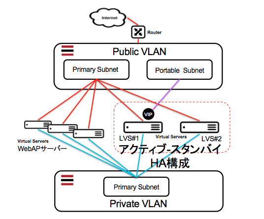

lvs01 Cookbook
==============
Linux Virtual Server (LVS)を使って負荷分散サーバーを構築するクックブックです。

LVSサーバーが単一障害点(SPOF)にならない様に、KeepAlivedを利用してHA構成を作ります。この時必要なVIPは、SOFTLAYERのポータブルサブネットを利用します。このポータブルサブネットは、VLANに対して追加でサブネットを割り当てるもので、Private と Public の両方のアドレスをオーダーできるので、インターネットからのアクセスと、Private VLAN内のサーバー同志のアクセスに利用できます。


システム構成
------------
このクックブックは、次の図の赤破線枠のLVSアクティブ-スタンバイの構成を作ります。マスター状態のLVSサーバーは、VIPを保持して振り分けを実施します。マスター状態のLVSサーバーが居なくなると、スタンバイ状態のLVSサーバーが昇格してVIPを保持して振り分けをおこないます。

このクックブックで実現する要求の振分けは、DR(ダイレクト・ルーティング)です。この方式は、要求をVIPで受け、実サーバーへ要求パケットを転送します。応答は、LVSを経由せずに直接返します。



要件
------------

### 確認済オペレーティング・システム
- Ubuntu Linux 14.04 LTS Trusty Tahr - Minimal Install (64 bit) 
- Debian GNU/Linux 8.x jessie/Stable - Minimal Install (64 bit)
- CentOS 6.x - Minimal Install (64 bit)


### ポータブル・サブネット
https://control.softlayer.com/ -> Network -> IP Management -> Subnet -> Order IP addresses から事前にオーダーしておきます。取得したサブネットから、VIPに割り当てるIPアドレスを選んでおきます。

### 実サーバーのIPアドレスとポート
- Webサーバー等の負荷分散対象のサーバーIPアドレス、ポート番号のCHEFのアトビュートとして設定するため、事前に確保しておく必要があります。

### Webサーバー側のループバックI/F設定
受けたパケットを実サーバーへフォワードするため、実サーバーでVIPのパケットを受信できる様に設定しなければなりません。Debian/Ubuntuでは /etc/network/interfacesのファイルに以下を追加する必要があります。 

```
auto lo:1
iface lo:1 inet static
      address 161.202.132.84    <-- VIPに置き換える
      netmask 255.255.255.255
```

### ARP設定の変更
ARPリクエスト受信時に、ループバックに割り当てたIPで応答しない様にします。この設定を外すと、LVSをバイパスして実サーバー転送される事になるので注意です。

```
net.ipv4.conf.lo.arp_ignore = 1
net.ipv4.conf.lo.arp_announce = 2
net.ipv4.conf.all.arp_ignore = 1
net.ipv4.conf.all.arp_announce = 2
```

### その他必要なパッケージ
ポストインストール・スクリプト等からインストールされていない場合は、以下の追加パッケージとファイアウォールの設定を行っておきます。

```
# apt-get install curl ufw git
# ufw allow from 10.0.0.0/8
# ufw enable
```


アトリビュート
----------

実サーバーが３台以上ある場合、["real_server_ip_addrN"],["real_server_portN"]を attributes/default.rb に追加し、recipes と templates の当該する変数を追加して、振分け対象を認識できる様にします。

["persistence_timeout"]に"0"を設定すると、実サーバーへ順番に割り当てていきます。そして、例えば、300をセットすると、最初に降り分けられた実サーバーへ継続的に降られる様になり、最後にアクセスしてから300秒（5分）を超過すると、新たに振分け先を決定します。

["public_prim_subnet"]は、パブリック側のプライマリ・サブネットのサブネットとネットマスクを設定します。これはアクティとスタンバイのLVSノードが、相互のパブリック側ポートを監視できる様にするためです。


#### lvs01::default
<table>
  <tr>
    <th>Key</th>
    <th>Type</th>
    <th>Description</th>
    <th>Default</th>
  </tr>

  <tr> 
    <td>["virtual_ipaddress1"]</td>
    <td>IP address</td>
    <td>代表となるIP (VIP)</td>
    <td>NULL (必須)</td>
  </tr>

  <tr> 
    <td>["virtual_portno1"]</td>
    <td>Port Number</td>
    <td>代表となるポート番号</td>
    <td>NULL (必須)</td>
  </tr>

  <tr> 
    <td>["persistence_timeout"]</td>
    <td>Number</td>
    <td>振り分けを固執する秒数</td>
    <td>0</td>
  </tr>

  <tr> 
    <td>["public_prim_subnet"]</td>
    <td>Number</td>
    <td>LVS nodes が所属するサブネットとマスク</td>
    <td>161.202.142.192/28</td>
  </tr>

  <tr> 
    <td>["real_server_ip_addr1"]</td>
    <td>IP address</td>
    <td>実サーバーのIPアドレス</td>
    <td>NULL (必須)</td>
  </tr>

  <tr> 
    <td>["real_server_port1"]</td>
    <td>Port Number</td>
    <td>実サーバーのポート番号</td>
    <td>NULL (必須)</td>
  </tr>

  <tr> 
    <td>["real_server_ip_addr2"]</td>
    <td>IP address</td>
    <td>実サーバーのIPアドレス</td>
    <td>NULL (必須)</td>
  </tr>

  <tr> 
    <td>["real_server_port2"]</td>
    <td>Port Number</td>
    <td>実サーバーのポート番号</td>
    <td>NULL (必須)</td>
  </tr>
</table>


使い方
------------

以下の順番でコマンドを実行して、サーバーにクックブックを置きます。

```
# curl -L https://www.opscode.com/chef/install.sh | bash
# knife cookbook create dummy -o /var/chef/cookbooks
# cd /var/chef/cookbooks
# git clone https://github.com/takara9/lvs01
```
アトリビュートを環境に合わせて編集して、以下のコマンドでサーバーに適用します。

```
# chef-solo -o lvs01
```

### 動作確認
次のコマンドで、VIPと実サーバーがリストされていれば、ひとまず動作している事になります。

```
root@lvs1:/var/chef/cookbooks# ipvsadm -Ln
IP Virtual Server version 1.2.1 (size=4096)
Prot LocalAddress:Port Scheduler Flags
  -> RemoteAddress:Port           Forward Weight ActiveConn InActConn
TCP  161.202.132.84:80 rr
  -> 161.202.142.204:80           Route   1      134        0         
  -> 161.202.142.206:80           Route   1      135        0     
```


参考資料
------------
1. LVS-HOWTO http://www.austintek.com/LVS/LVS-HOWTO/HOWTO
2. The Linux Virtual Server Project http://www.linuxvirtualserver.org
3. RedHat Enterprise Linux 6 第3章 Load Balancer Add-On の設定 https://access.redhat.com/documentation/ja-JP/Red_Hat_Enterprise_Linux/6/html/Load_Balancer_Administration/ch-lvs-setup-VSA.html
4. RedHat Enterprise Linux 7 ロードバランサーの管理 https://access.redhat.com/documentation/ja-JP/Red_Hat_Enterprise_Linux/7/html/Load_Balancer_Administration/index.html
5. Keepalived for Linux http://www.keepalived.org/
6. ipvsadm(8) -Linux man page http://linux.die.net/man/8/ipvsadm
7. keepalived.conf(5) - Linux man page http://linux.die.net/man/5/keepalived.conf


License and Authors
-------------------

Authors: Maho Takara

License: see LICENCE file


